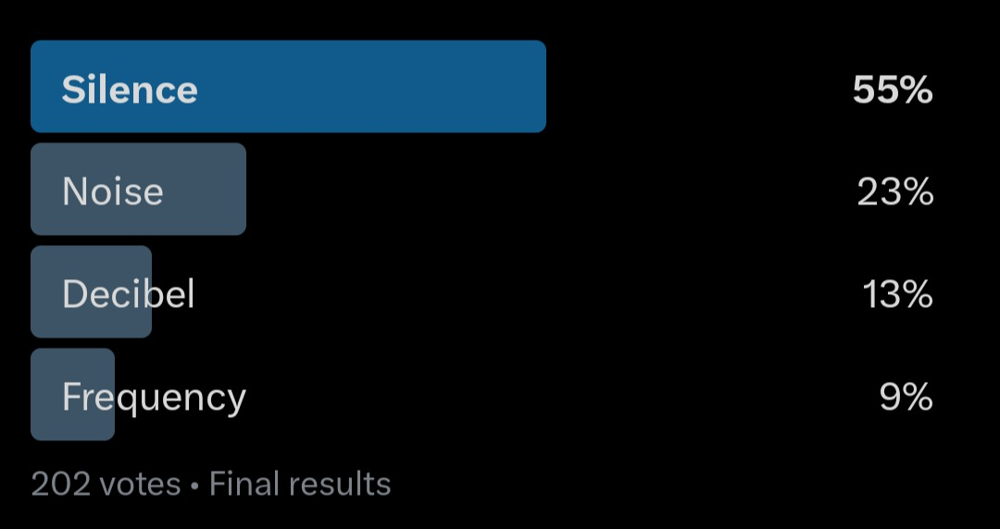

# Silencio - Raffle Airdrop

## Overview

The Silencio Raffle Airdrop script automates the process of distributing prizes to eligible users based on their raffle tickets. The script uses a deterministic, seed-based method to ensure transparency and fairness in prize allocation.

## How It Works

1. **Load User Data**: Reads the current users and their assigned raffle tickets from a CSV file. User IDs are hashed using the SHA-256 algorithm to ensure privacy.v
2. **Load Prize Allocation**: Reads coin allocation types and prize distributions from `/token_assignment` folder.
3. **Raffle Process**:
    - Users are sorted by the number of raffle tickets and their hashed user ID.
    - A seeded hash is generated for each prize using an incremental seed string.
    - The resulting hash is converted to an integer and used to select the raffle tickets.
    - The prize is then assigned to the user holding the corresponding ticket.
4. **Output Generation**:
    - Intermediate results are saved to `aggregate_results/`.
    - The final raffle results are saved in `raffle_results/raffle_results.csv`.

## Seed Generation

The raffle seed is generated based on the results of a [community poll conducted on the Silencio X account](https://x.com/silencioNetwork/status/1961450032009298423), resulting in the following seed strings. The digits used in the seed are the rounded numbers found in the mobile X app (Individual options are rounded to whole numbers in the app, so the displayed totals may differ slightly from 100%):



- **For SLC Prizes:**
  ```
  Silencio_Raffle_Season7:Silence55%-Noise23%-Decibel13%-Frequency9%-SLC:
  ```

The seed string is automatically set based on the selected `run_mode` and is concatenated with incremental numbers to generate a unique hash for each prize.

## File Structure

```
.
├── raffle_airdrop.py                # Main script to run the raffle
├── requirements.txt                 # Required Python packages
├── token_assignment                 # Prize allocation files
│   ├── slc_prizes.csv               # SLC token prize distribution
├── silencio_raffle_eligible_users_september_2025.csv  # Eligible users with raffle tickets
├── raffle_results                   # Final raffle output files
└── aggregate_results                # Intermediate output files
```

## Requirements

The following Python libraries are required to run the script:

- `python==3.9.13`
- `pandas==1.4.4`
- `numpy==1.21.5`

Additional files needed:
- `/token_assignment/prize_tokens.csv`: Defines the quantity and value of each token prize.

## Installation

1. **Set up a virtual environment** (recommended):
```bash
python -m venv reward-system
source reward-system/bin/activate     # On Windows use `reward-system\Scripts\activate`
```

2. **Install dependencies**:
```bash
pip install -r requirements.txt
```

## Usage

1. **Select Run Mode**:

Set the `run_mode` variable in `raffle_airdrop.py` to `'slc_prizes'`. The raffle seed is automatically set based on the selected mode:

```python
run_mode = 'slc_prizes'
```

2. **Run the script**:
```bash
python raffle_airdrop.py
```

## Output

### Intermediate Outputs

- **Aggregate Prize Data**:
  - Saved in `aggregate_results/`.
  - Displays the total quantity and SLC value for each prize type.

### Final Output

The final raffle results are saved in `raffle_results/raffle_results.csv`.

#### Example of `raffle_results.csv`:

| Column Name          | Description |
|----------------------|-------------|
| **hashed_user_id**   | Unique hashed identifier for the user (SHA-256). |
| **tickets**          | The number of tickets the user holds. |
| **claimable_amount** | The total SLC or prize value earned by the user. |
| **iron**             | Number of Iron Nuggets earned by the user. |
| **bronze**           | Number of Bronze Nuggets earned by the user. |
| **silver**           | Number of Silver Nuggets earned by the user. |
| **gold**             | Number of Gold Nuggets earned by the user. |
| **platinum**         | Number of Platinum Nuggets earned by the user. |
| **amethyst**         | Number of Amethyst Crystals earned by the user. |
| **sapphire**         | Number of Sapphire Gemstones earned by the user. |
| **emerald**          | Number of Emerald Gemstones earned by the user. |
| **ruby**             | Number of Ruby Gemstones earned by the user. |
| **diamond**          | Number of Diamond Jewels earned by the user. |

# Verify that these are the original files used in the raffle

Files were hashed and stored on chain. If you want to verify these files weren't tampered with since the raffle you can follow these steps:

1. Download or clone repository (you might get a different checksum hash if cloning the repository into some systems that add CRLF line terminators. Both checksum hashes were published on the blockchain for you to verify.)

2. Apply a sha256 Checksum to any of the following files (**generate sha256 file checksum**) and validate against the hashes stored on this file `raffle-season-7/hashed_files_raffle_airdrop_september_2025.txt`: 
- `silencio_raffle_eligible_users_september_2025.csv`
- `token_assignment/slc_prizes.csv`
- `raffle_airdrop.py`
- `raffle_results/slc_prizes_raffle_results.csv`
- `community_seed_vote.jpg`
